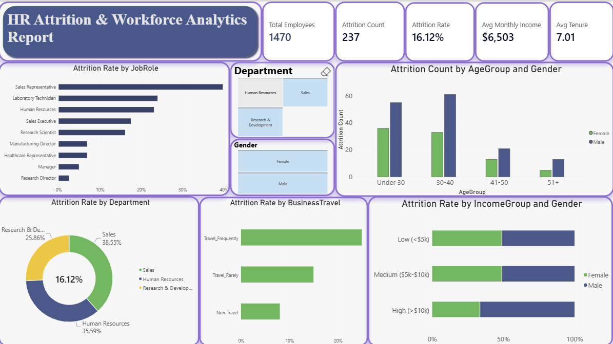

# HR Attrition & Workforce Analytics Dashboard

## Executive Summary
This project analyzes employee attrition drivers within an organization using SQL and Power BI. The goal is to provide HR leadership with actionable data insights to improve employee retention, reduce turnover costs, and optimize workforce planning.

## Key Insights
- **Baseline Attrition:** Overall company attrition rate stands at **16.12%** (237 out of 1,470 employees).
- **High-Risk Roles:** Sales Representatives experience the highest attrition rate (~38.55%), followed by Laboratory Technicians and HR personnel.
- **Demographic Vulnerability:** Younger employees under age 30 show significantly higher turnover rates compared to senior tenure groups.
- **Operational Drivers:** Frequent business travel and lower income brackets (<$5k/month) correlate directly with higher attrition.

## Tech Stack
- **Database / ETL:** SQL Server Management Studio (Data Aggregation, Filtering, Window Functions)
- **Visualization:** Power BI Desktop (DAX Calculated Measures, Data Modeling, Custom Layout Design)
